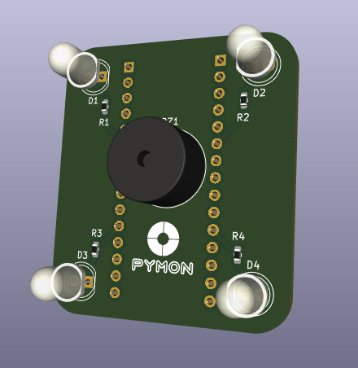
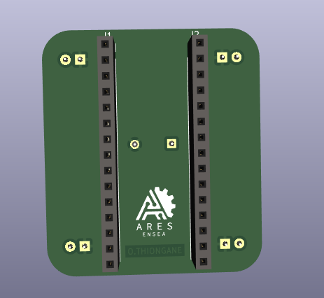

# KiCad Pymon PCB
The electronic board of the Pymon game rests in this folder.

The PCB contains 4 LEDs and their associated resistors, a buzzer, and two female connectors for the NUCLEO F303K8 board.

    

    

