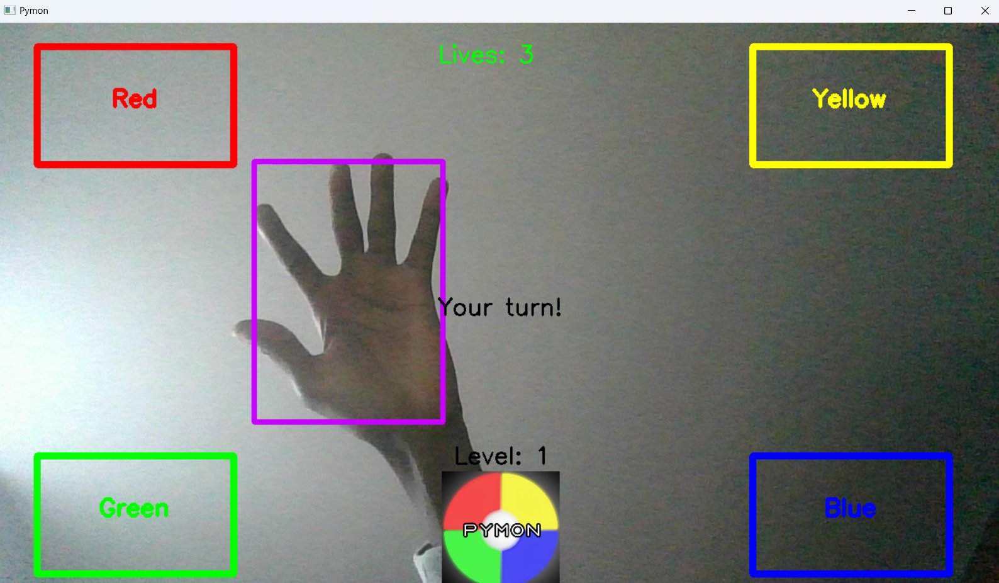

# Python Pymon
In this directory lies the software part of Pymon. Camera and display (text, rectangles) management is done using the OpenCV library. To run this game, we use the MediaPipe library for real-time hand detection and tracking. The pyserial library allows us to communicate between our program and the STM32 connected via USB cable.

## Game Sections
### Menu
The menu allows us to access settings or start the game.

### Game
Buttons of 4 colors are displayed on the screen. The game prompts the player to watch the sequence of colors made on the device, then replicate it. Each successful level increases the sequence length by 1. Mistakes deduct life points until game over.

### Settings
Settings provide access to Score, Difficulty, and Player sections.

### Difficulty
Allows choosing between easy mode (each level's sequence remains identical to the previous one, with an additional random color) and hard mode (the sequence completely changes at each level).

### Score
This section allows the player to view their best score (i.e., the highest level reached). There's a separate best score for easy and hard modes.

### Player (Under development...)
Facial recognition could be added to register the current player. This would allow comparing scores between players.
