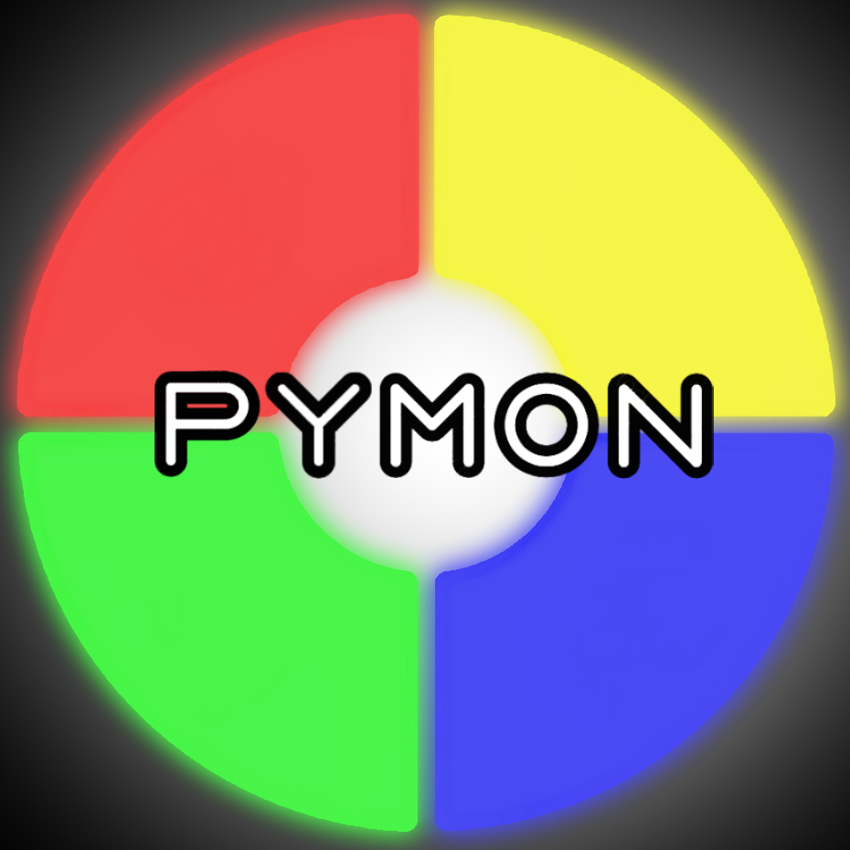
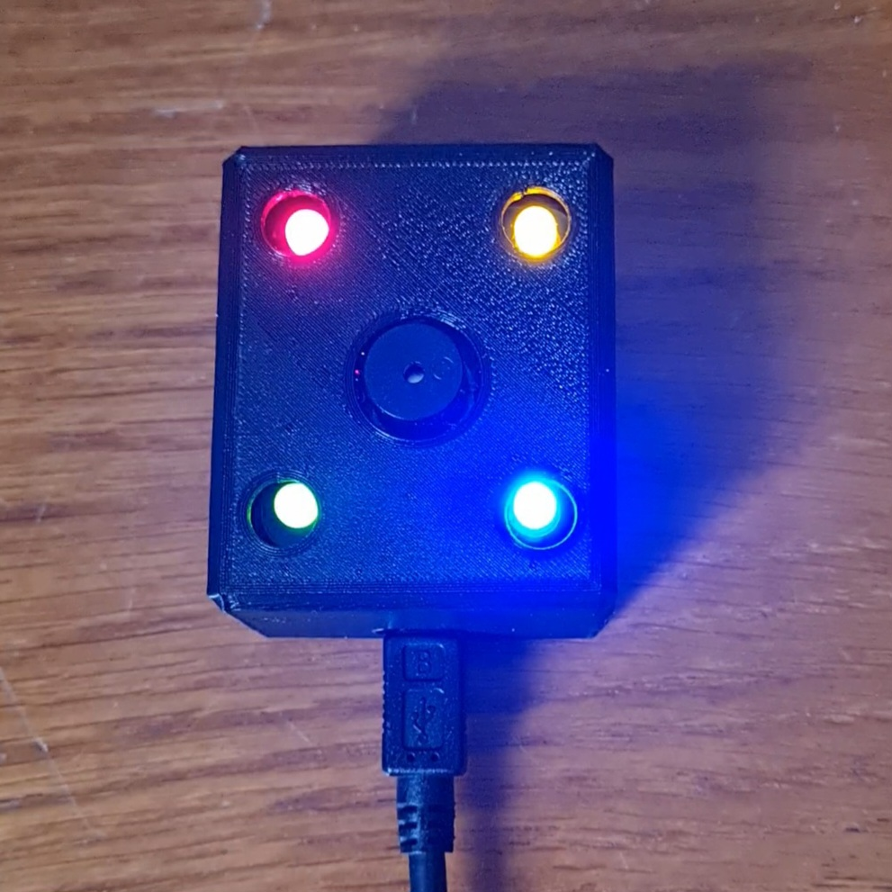

# Pymon
Game project developed with OpenCV and STM32 for the Image & Virtual Reality Workshop.



# About the game
Pymon is a Python derivative of the game Simon where the objective is to memorize and reproduce sequences of random colors.

The unique aspect of Pymon is that the game interface is created using the player's computer camera, and color selection is done directly on the screen by hand detection.

Serial communication is established with the game box to retrieve player inputs.

# How to play? 
Clone this repository to your computer:
```
git clone https://github.com/Mowibox/Pymon.git
```
Connect the game device to your computer; a sound sequence should play if everything is working correctly.

Open the "Pymon.py" file in the Python folder. Install the following libraries:
```
pip install open-cv python
```
```
pip install mediapipe
```
```
pip install pyserial
```
Run the code and have fun!

